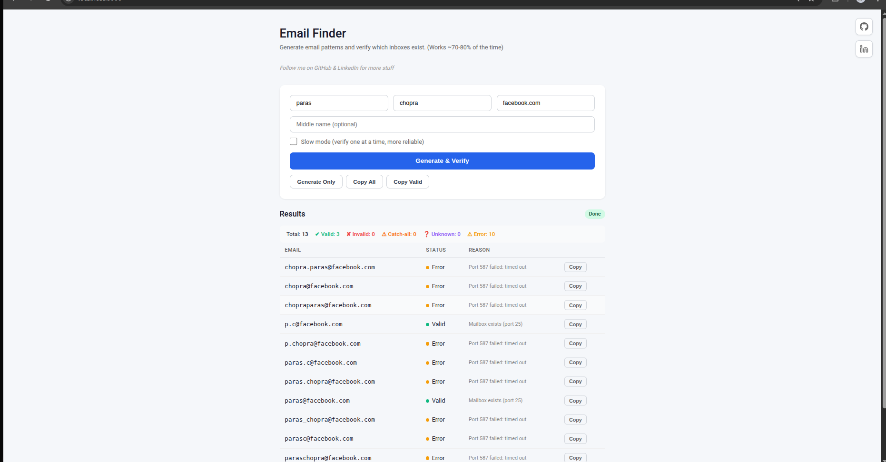

# Pyxis

Generate and verify email addresses for job applications // reach out.
free and self hosted



## Features

- Generate 13+ common email patterns from name + domain (add more patterns in main.py)
- Verify inboxes via SMTP handshake
- Works with Gmail, Outlook, and most business email providers
- Zoho detection (blocks verification from dynamic IPs)

## Quick Start

### First-time setup (if you don't have `uv` installed)

**macOS/Linux:**
```bash
curl -LsSf https://astral.sh/uv/install.sh | sh
```

**Windows (PowerShell):**
```powershell
powershell -c "irm https://astral.sh/uv/install.ps1 | iex"
```

### Run the app

```bash
# Install dependencies
uv sync

# Run server
uv run uvicorn main:app --port 8000
```

Open http://localhost:8000

## Usage

1. Enter first name, last name (optional), and domain
2. Click "Generate & Verify"
3. Results show:
   - **Valid** (green) - inbox exists
   - **Invalid** (red) - inbox doesn't exist
   - **Unknown** (purple) - provider blocks verification
   - **Error** (yellow) - connection failed

## Limitations

- **Zoho**: Blocks verification from residential/dynamic IPs
- **Gmail/Outlook**: May show "Invalid" for existing accounts if they block probes
- Port 25 may be blocked by your ISP

## Self-Host

Any machine with Python 3.12+:

```bash
uv sync
uv run uvicorn main:app --host 0.0.0.0 --port 8000
```

For production, use a reverse proxy like nginx with HTTPS.